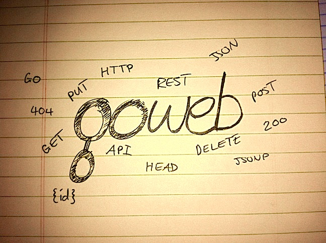

# Goweb

A lightweight RESTful web framework for Go.

  * For examples and usage, please read the [Goweb API Documentation](http://godoc.org/github.com/stretchr/goweb)
  * Read our [Articles](https://github.com/stretchr/goweb/wiki)

## Who uses Goweb?

  * "Using Goweb has greatly simplified the creation, maintenance, and consistency of several of our internal services, allowing us to focus our effort on the underlying behavior of the services themselves." Derek Buitenhuis, [Vimeo](https://vimeo.com/)
  * "We are actively developing with Goweb to implement the REST api in-front of a neural network application" Jon McMillan, [MCN Healthcare](http://www.mcnhealthcare.com/)
  * "We are developing an API on top of Goweb that will power our platform as well as allow customers to access our data via a REST API." Robert Mulley, [CB Insights](http://www.cbinsights.com/)

#### Are you using Goweb?

We are looking to put together a list of companies / people that are using Goweb.  If you would like to help promote Goweb, and be included in the list, please [comment on our issue](https://github.com/stretchr/goweb/issues/40) and we'll get it going.  Thanks.

## Get started

  * To install, run `go get github.com/stretchr/goweb`
  * Import the package as usual with `import "github.com/stretchr/goweb"` in your code.
  * Look at the [example_webapp](https://github.com/stretchr/goweb/blob/master/example_webapp/main.go) project for some ideas of how to get going
  * Read the [Goweb API Documentation](http://godoc.org/github.com/stretchr/goweb)
  * To update to the latest version of goweb, just run `go get -u github.com/stretchr/goweb`

## Features

  * Drastically improved path matching
  * Cleaner interface for responding (e.g. `goweb.API.RespondWithData`, and `goweb.Respond.WithRedirect`)
  * More control over standard response object for API responses
  * Cleaner RESTful interface design
    * Default OPTIONS implementation that informs clients what methods the controller exposes
  * Easily publish static files as well as code driven output
  * Much easier to write testable code
  * Better package structure
  * Modular design, making adding new stuff easy
  * Handler mechanism to easily add pre and post handlers to certain requests
  * Uses [stretchr/codecs](https://github.com/stretchr/codecs) package allowing better support for multiple formats
  * Easily match paths using Regex instead
  * Better error management
  * Performance improvements from Goweb 1

## Interesting [articles](https://github.com/stretchr/goweb/wiki)

  * [Mapping deep nested RESTful controllers](https://github.com/stretchr/goweb/wiki/Mapping-deep-nested-RESTful-controllers)
  * [Using different HTTP Methods when mapping controllers](https://github.com/stretchr/goweb/wiki/Using-different-HTTP-Methods-when-mapping-controllers)
  * [Controlling API output](https://github.com/stretchr/goweb/wiki/Controlling-API-output)

## People who use Goweb also use

  * [Gomniauth](https://github.com/stretchr/gomniauth) - Authentication package (OAuth2 etc.)

## Requirements

  * Goweb runs on Go 1.1

------

Contributing
============

Please feel free to submit issues, fork the repository and send pull requests.  Be sure to [check out our development practices](https://github.com/stretchr/goweb/wiki/Development-practices) before you get going.

When submitting an issue, we ask that you please include steps to reproduce the issue so we can see it on our end also!

Licence
=======
Copyright (c) 2012 - 2013 Mat Ryer and Tyler Bunnell

Please consider promoting this project if you find it useful.

Permission is hereby granted, free of charge, to any person obtaining a copy of this software and associated documentation files (the "Software"), to deal in the Software without restriction, including without limitation the rights to use, copy, modify, merge, publish, distribute, sublicense, and/or sell copies of the Software, and to permit persons to whom the Software is furnished to do so, subject to the following conditions:

The above copyright notice and this permission notice shall be included in all copies or substantial portions of the Software.

THE SOFTWARE IS PROVIDED "AS IS", WITHOUT WARRANTY OF ANY KIND, EXPRESS OR IMPLIED, INCLUDING BUT NOT LIMITED TO THE WARRANTIES OF MERCHANTABILITY, FITNESS FOR A PARTICULAR PURPOSE AND NONINFRINGEMENT. IN NO EVENT SHALL THE AUTHORS OR COPYRIGHT HOLDERS BE LIABLE FOR ANY CLAIM, DAMAGES OR OTHER LIABILITY, WHETHER IN AN ACTION OF CONTRACT, TORT OR OTHERWISE, ARISING FROM, OUT OF OR IN CONNECTION WITH THE SOFTWARE OR THE USE OR OTHER DEALINGS IN THE SOFTWARE.
